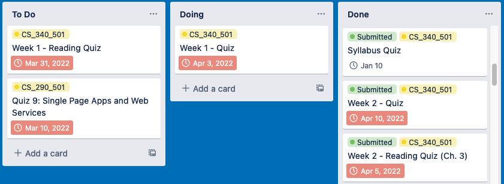

# Canvas to Trello

Canvas to Trello is an application for syncing Canvas assignments to a Trello board of your choice. It imports the assignment name, due date, submission status, and course from Canvas to Trello cards. It also will update cards if an assignment changes. 

## Getting Started

**IMPORTANT: This application is for my personal use and will not successfully run in its current state.**

**According to Canvas, "asking any other user to manually generate a token and enter it into your application is a violation of Canvas' terms of service." Canvas requires the authentication protocol, OAuth, for an application like this one. To use OAuth, individual institutions using Canvas would have to approve the use of this application in their system. Rather than jump through these hoops, this application is for my personal use only and the portion of the application that would ask for a token has been disabled.**

Note: This application stores all API information locally.

### Prerequisites

Requirements for this software:
- [A Trello Account](https://trello.com/)
- [A Canvas Account (normally provided by your institution)](https://www.instructure.com/canvas)
- [Python3](https://www.python.org/downloads/)
- [SQLite](https://www.sqlite.org/index.html)

### Installing

First, clone this repository and navigate to the cloned repository with the terminal of your choice.

Make the shell script executable:

    chmod +x canvastotrello.sh

To run, use the following:

    ./canvastotrello.sh

The first time the program runs it will guide you through an interactive setup. After the setup is complete, running it again will re-sync Canvas assignments to Trello, adding or updating cards as needed.

## Future Development

Goals:

- Set up OAuth and publish this app on a website like [EduAppCenter](https://www.eduappcenter.com/), allowing learning institutions to add this application to their system.

## Authors

  - [KameronKeller](https://github.com/KameronKeller)

## License

This project is licensed under the [GNU GPLv3 ](LICENSE.md)
GNU General Public License - see the [LICENSE.md](LICENSE.md) file for
details

## Acknowledgments

Thanks to the following Python packages!

  - [py-trello](https://github.com/sarumont/py-trello) for the Trello API wrapper.
  - [canvasapi](https://github.com/ucfopen/canvasapi) for the Canvas API wrapper.
  - [simple-term-menu](https://github.com/IngoMeyer441/simple-term-menu) for the nice command line tool.
